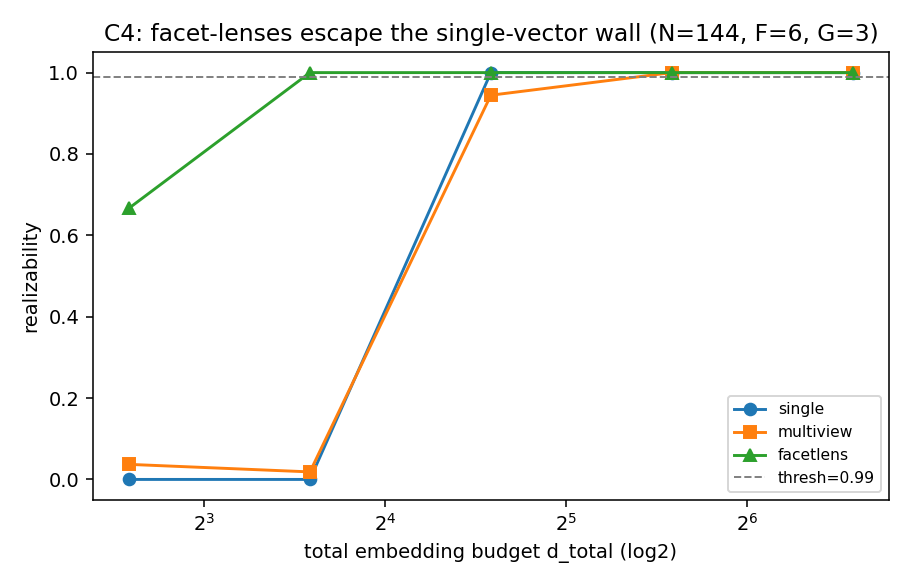

# C4 — Facet-Lens Escape (N=144, F=6, G=3)

Realizability vs total embedding budget; equal budget across conditions; seeds=[0, 1, 2].

| mode | critical budget d* (realizability ≥ 0.99) |
|---|---|
| single | 24 |
| multiview | 48 |
| facetlens | 12 |

If routed **facetlens** reaches realizability=1 at a far smaller budget than
**single** (and below generic **multiview**), facet-specialized lenses are a
principled escape from the single-vector capacity wall — the paper's method (C4).

