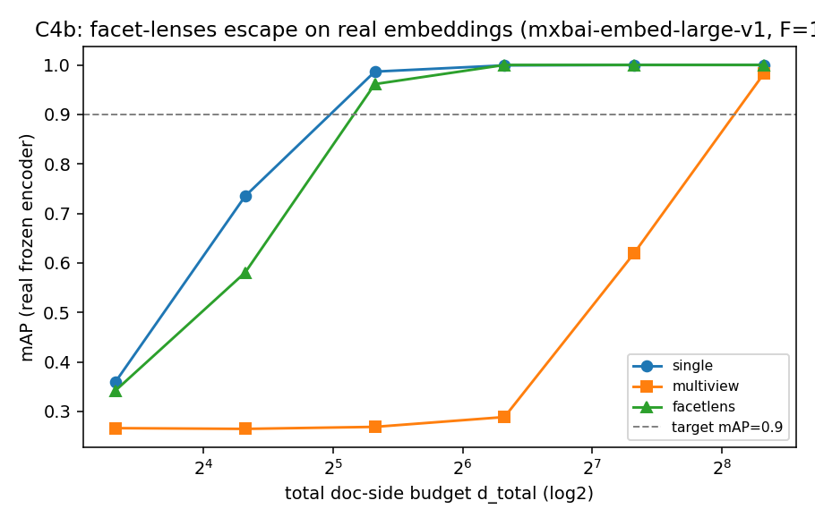

# C4b — Real-Encoder Facet-Lens Escape (mxbai-embed-large-v1, F=10)

Frozen `mixedbread-ai/mxbai-embed-large-v1` embeddings of a facet-structured corpus (N=300, facets=['profession', 'city', 'hobby', 'pet', 'vehicle', 'instrument', 'color', 'sport', 'drink', 'language']); learned low-rank lenses at equal doc-side budget; seeds=[0, 1, 2].

| budget d_total | single mAP | multiview mAP | facetlens mAP |
|---|---|---|---|
| 10 | 0.360 | 0.266 | 0.342 |
| 20 | 0.735 | 0.265 | 0.581 |
| 40 | 0.987 | 0.269 | 0.961 |
| 80 | 0.999 | 0.289 | 1.000 |
| 160 | 1.000 | 0.620 | 1.000 |
| 320 | 1.000 | 0.982 | 1.000 |

Budget to reach mAP ≥ 0.9: **single** 40, **multiview** 320, **facetlens** 40.

If routed **facetlens** reaches the target at a smaller budget than **single** (and
beats generic **multiview**), the C4 escape holds on real semantic embeddings, not just
free vectors — the representation-geometry claim survives a real frozen encoder.

