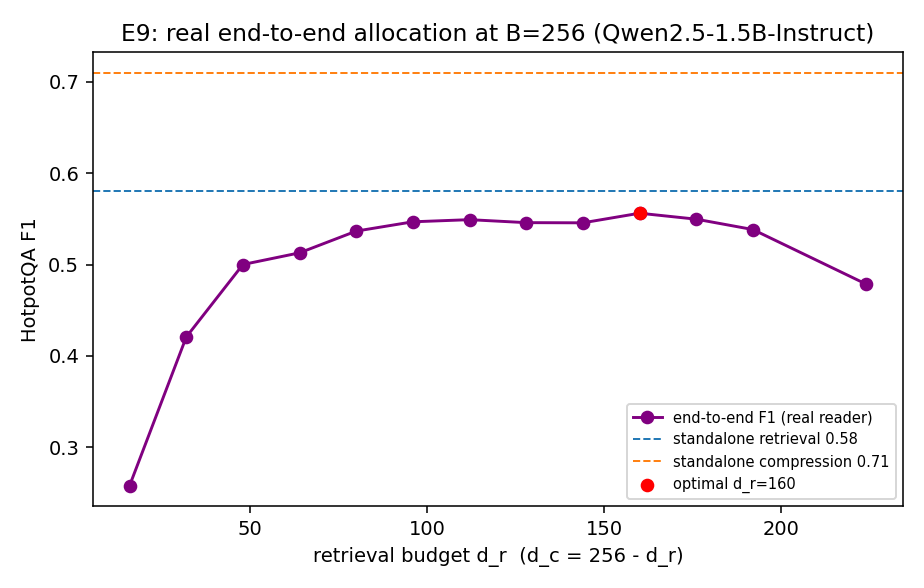

# E9 — Real End-to-End RAG QA (HotpotQA, Qwen2.5-1.5B-Instruct)

Real multi-hop QA: 300 questions over a pooled corpus of 1500 paragraphs; real retriever (`mxbai-embed-large-v1`, truncated to d_r) + query-conditioned sentence selection (d_c) under a 160-token reader budget; frozen reader answers, scored by EM/F1. Shared budget B = d_r + d_c.

| budget B | best split d_r:d_c | best F1 | standalone R | standalone C | compounding gap |
|---|---|---|---|---|---|
| 128 | 80:48 | 0.528 | 0.549 | 0.708 | 0.020 |
| 256 | 160:96 | 0.556 | 0.581 | 0.710 | 0.025 |

Metric for the gap is **F1** (real reader EM/F1 when the reader is enabled, else the answer-in-context diagnostic). A positive gap is compounding on real answer quality: the best budget split underperforms either stage given the full budget, and the optimum is interior — the real-task version of E6, and the reviewer-proof form of C2/C3.

