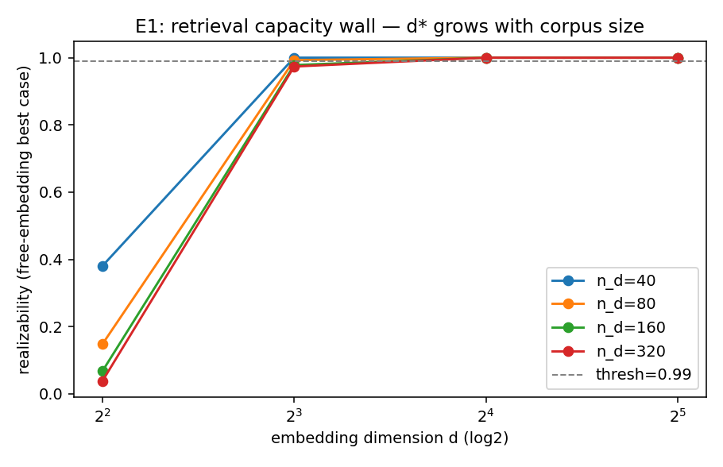

# E1 — Retrieval Capacity Wall

Pattern: **all_pairs** (k=2); dims=[4, 8, 16, 32]; seeds=[0, 1].

Free-embedding realizability is the *best case* for any encoder of a given
dimension. The critical dimension d* (smallest d reaching realizability >= 0.99) grows with corpus size — this is the embedding wall.

| corpus n_d | critical dim d* |
|---|---|
| 40 | 8 |
| 80 | 8 |
| 160 | 16 |
| 320 | 16 |

If d* increases with n_d, the harness reproduces Weller et al.'s wall and is
validated for the compression (E2) and composition (E3) stages.

