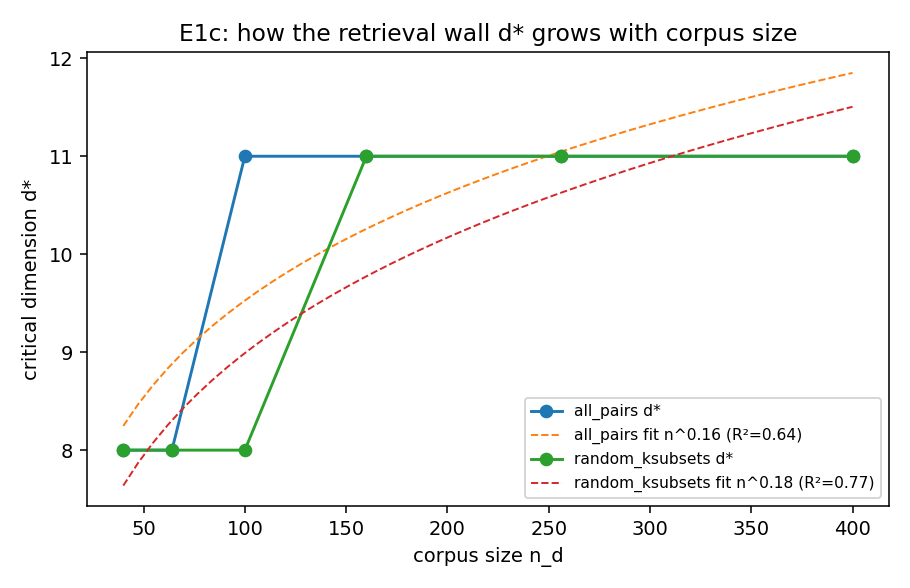
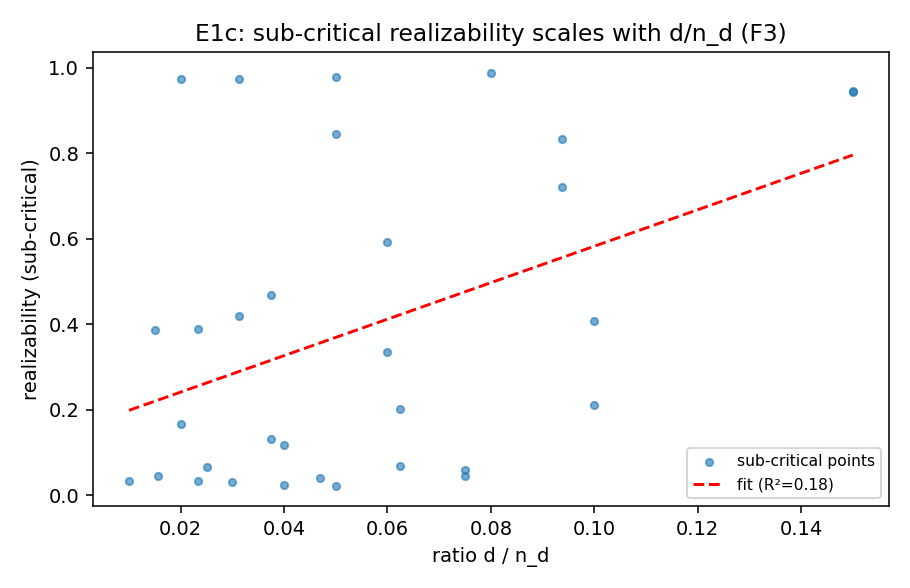

# E1c — Retrieval-Wall Scaling Fit (F3)

Patterns ['all_pairs', 'random_ksubsets']; dims=[2, 3, 4, 6, 8, 11, 16, 22, 32]; n_d=[40, 64, 100, 160, 256, 400]; seeds=[0, 1, 2, 3, 4].

## Critical dimension d*(n_d)

| pattern | d* per n_d | power fit d*=a·n_d^b (R²) | log fit (R²) |
|---|---|---|---|
| all_pairs | 40:8, 64:8, 100:11, 160:11, 256:11, 400:11 | 4.61·n^0.16 (0.64) | 0.68 |
| random_ksubsets | 40:8, 64:8, 100:8, 160:11, 256:11, 400:11 | 3.96·n^0.18 (0.77) | 0.77 |

## Sub-critical scaling (F3 conjecture)

Pooled over patterns, sub-critical realizability ≈ **4.264·(d/n_d) + 0.156** (R² = 0.18, n = 32). A high R² with a near-linear dependence on d/n_d upgrades F3 to a quotable scaling and makes the allocation law (C3) concrete: fund retrieval to d*(n_d).

