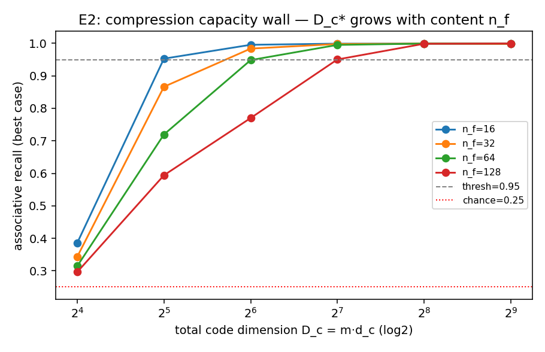
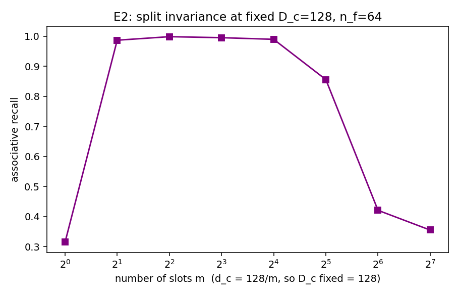

# E2 — Compression Capacity Wall (C1)

Slot-memory associative recall; d_c=16, V=4 (chance=0.25), P=128 passages, seeds=[0, 1, 2].

Critical code size D_c* (smallest D_c reaching recall >= 0.95) vs content complexity n_f:

| facts n_f | critical D_c* |
|---|---|
| 16 | 32 |
| 32 | 64 |
| 64 | 128 |
| 128 | 128 |

If D_c* grows with n_f, soft-token compression has a dimension wall of the same
geometric form as retrieval (E1) — i.e. a genuine *second* bottleneck. The split-
invariance probe (fig 2) tests whether only the product m·d_c matters at fixed D_c.

