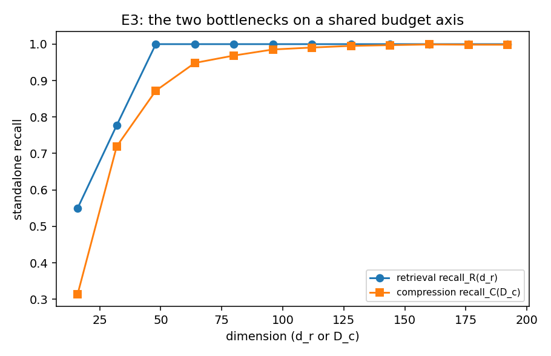
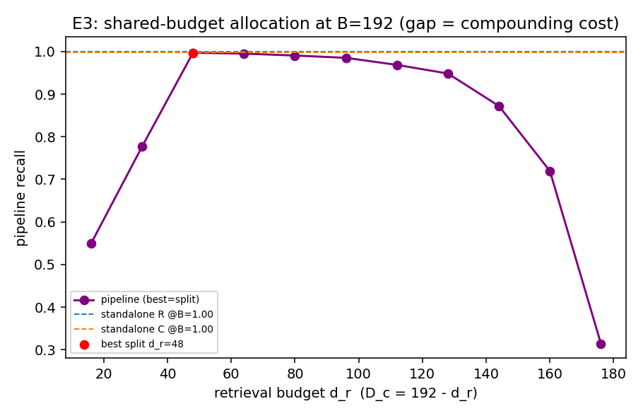

# E3 — Shared-Budget Compounding (C2 headline + C3 allocation)

Two bottlenecks share one budget B = d_r + D_c. Pipeline recall (independent-error
baseline) = recall_R(d_r) · recall_C(D_c). A positive gap vs min(standalone at B)
is the compounding cost; the argmax split is the optimal allocation (C3).

| budget B | standalone R | standalone C | best-split pipeline | optimal d_r:D_c | compounding gap |
|---|---|---|---|---|---|
| 64 | 1.000 | 0.948 | 0.559 | 32:32 | 0.389 |
| 96 | 1.000 | 0.985 | 0.872 | 48:48 | 0.113 |
| 128 | 1.000 | 0.995 | 0.969 | 48:80 | 0.027 |
| 160 | 1.000 | 0.999 | 0.991 | 48:112 | 0.008 |
| 192 | 1.000 | 0.998 | 0.997 | 48:144 | 0.001 |

If the gap is positive, the pipeline cannot match either stage given the full
budget — the two fixed-dimensional bottlenecks compound. The optimal split is
typically interior; budgeting all of B to one stage (the deployed habit of a big
embedder + a tiny compressor) is off the frontier.

v1 uses the optimistic independent-error composition; correlated example hardness
(E3b) can only widen the gap. Honest scope note in research-log.

