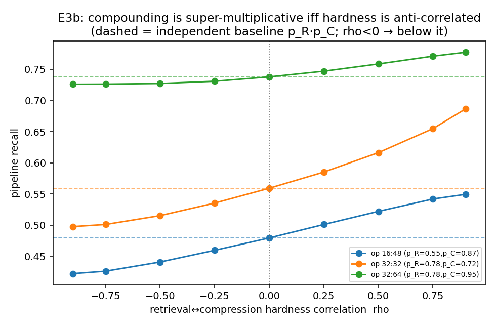

# E3b — Hardness Dependence (when does compounding go super-multiplicative?)

At tight operating points (both stages sub-saturated), pipeline recall vs the
retrieval↔compression hardness correlation rho. Independent baseline = p_R·p_C.

| operating point d_r:D_c | p_R | p_C | independent (rho=0) | pipeline rho=-0.5 | pipeline rho=+0.9 | Fréchet [lo,hi] |
|---|---|---|---|---|---|---|
| 16:48 | 0.550 | 0.872 | 0.480 | 0.441 | 0.550 | [0.422, 0.550] |
| 32:32 | 0.777 | 0.720 | 0.559 | 0.515 | 0.687 | [0.497, 0.720] |
| 32:64 | 0.777 | 0.948 | 0.737 | 0.727 | 0.777 | [0.726, 0.777] |

Reading: rho < 0 (retrieval-easy items are compression-hard and vice versa) pushes
the pipeline *below* the independent product — super-multiplicative compounding. rho
> 0 (same items hard for both) makes failures redundant, *above* the product. So the
compounding sign is set by hardness alignment, an empirical property of the corpus —
the next step is to measure rho for real retrievers+compressors.

