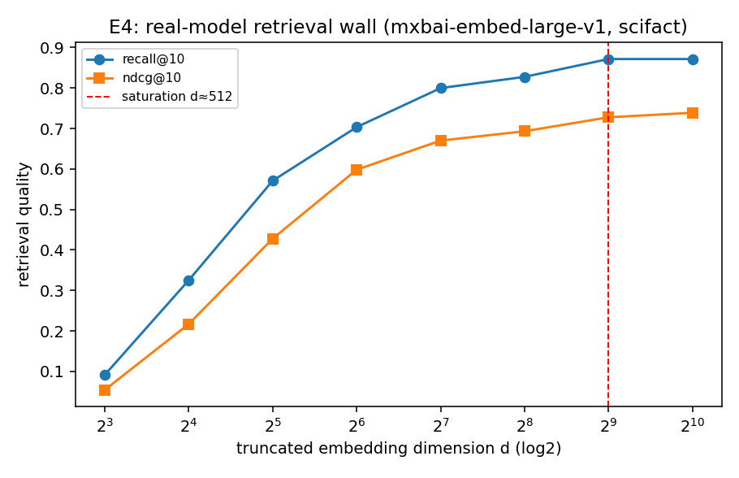

# E4 — Real-Model Retrieval Wall (scifact)

Embedder: `mixedbread-ai/mxbai-embed-large-v1` (full dim 1024); corpus 5183 docs, 300 queries; Matryoshka truncation + renormalize.

| dim d | recall@10 | ndcg@10 |
|---|---|---|
| 8 | 0.091 | 0.054 |
| 16 | 0.325 | 0.217 |
| 32 | 0.571 | 0.428 |
| 64 | 0.703 | 0.598 |
| 128 | 0.800 | 0.670 |
| 256 | 0.828 | 0.693 |
| 512 | 0.872 | 0.728 |
| 1024 | 0.872 | 0.739 |

Saturation dimension (>= 98% of full-dim recall): **d ≈ 512**. Embedding
dimension beyond this adds little retrieval quality — the real-model echo of E1's
wall, and (per C3) wasted budget that the allocation law would move to compression.

