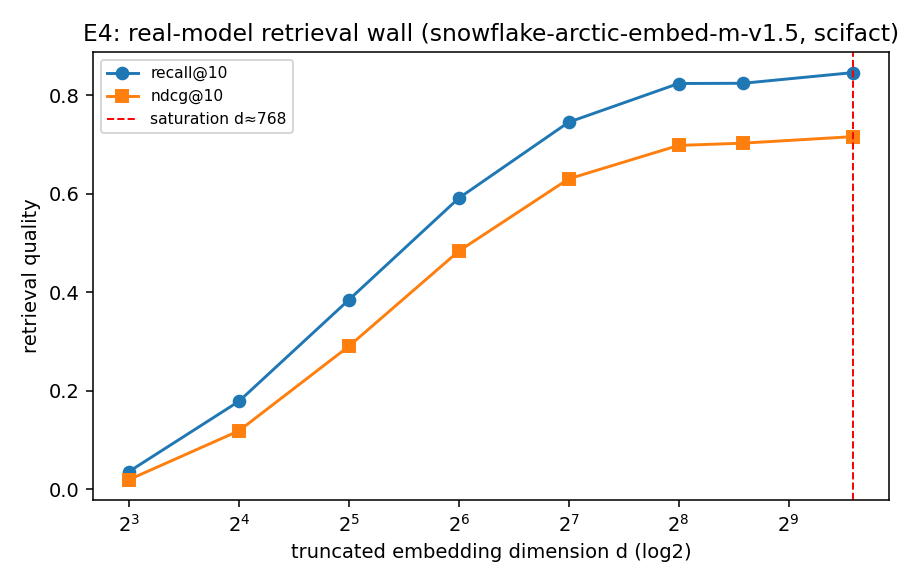

# E4 — Real-Model Retrieval Wall (scifact)

Embedder: `Snowflake/snowflake-arctic-embed-m-v1.5` (full dim 768); corpus 5183 docs, 300 queries; Matryoshka truncation + renormalize.

| dim d | recall@10 | ndcg@10 |
|---|---|---|
| 8 | 0.036 | 0.019 |
| 16 | 0.178 | 0.119 |
| 32 | 0.385 | 0.290 |
| 64 | 0.591 | 0.483 |
| 128 | 0.745 | 0.630 |
| 256 | 0.824 | 0.698 |
| 384 | 0.824 | 0.703 |
| 768 | 0.846 | 0.716 |

Saturation dimension (>= 98% of full-dim recall): **d ≈ 768**. Embedding
dimension beyond this adds little retrieval quality — the real-model echo of E1's
wall, and (per C3) wasted budget that the allocation law would move to compression.

