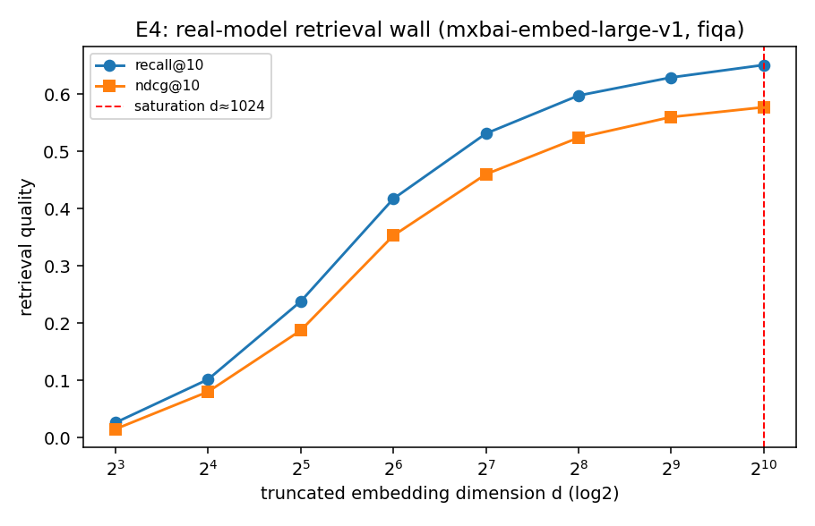

# E4 — Real-Model Retrieval Wall (fiqa)

Embedder: `mixedbread-ai/mxbai-embed-large-v1` (full dim 1024); corpus 15000 docs, 648 queries; Matryoshka truncation + renormalize.

| dim d | recall@10 | ndcg@10 |
|---|---|---|
| 8 | 0.026 | 0.015 |
| 16 | 0.102 | 0.080 |
| 32 | 0.238 | 0.187 |
| 64 | 0.417 | 0.353 |
| 128 | 0.531 | 0.460 |
| 256 | 0.597 | 0.524 |
| 512 | 0.629 | 0.560 |
| 1024 | 0.651 | 0.577 |

Saturation dimension (>= 98% of full-dim recall): **d ≈ 1024**. Embedding
dimension beyond this adds little retrieval quality — the real-model echo of E1's
wall, and (per C3) wasted budget that the allocation law would move to compression.

