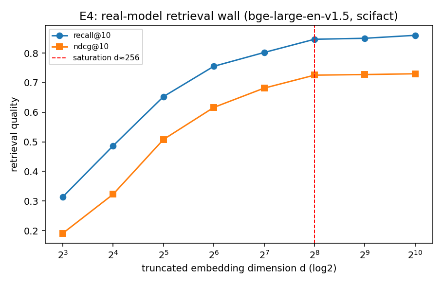

# E4 — Real-Model Retrieval Wall (scifact)

Embedder: `BAAI/bge-large-en-v1.5` (full dim 1024); corpus 5183 docs, 300 queries; Matryoshka truncation + renormalize.

| dim d | recall@10 | ndcg@10 |
|---|---|---|
| 8 | 0.314 | 0.191 |
| 16 | 0.487 | 0.323 |
| 32 | 0.653 | 0.508 |
| 64 | 0.755 | 0.616 |
| 128 | 0.802 | 0.681 |
| 256 | 0.847 | 0.725 |
| 512 | 0.850 | 0.727 |
| 1024 | 0.860 | 0.730 |

Saturation dimension (>= 98% of full-dim recall): **d ≈ 256**. Embedding
dimension beyond this adds little retrieval quality — the real-model echo of E1's
wall, and (per C3) wasted budget that the allocation law would move to compression.

