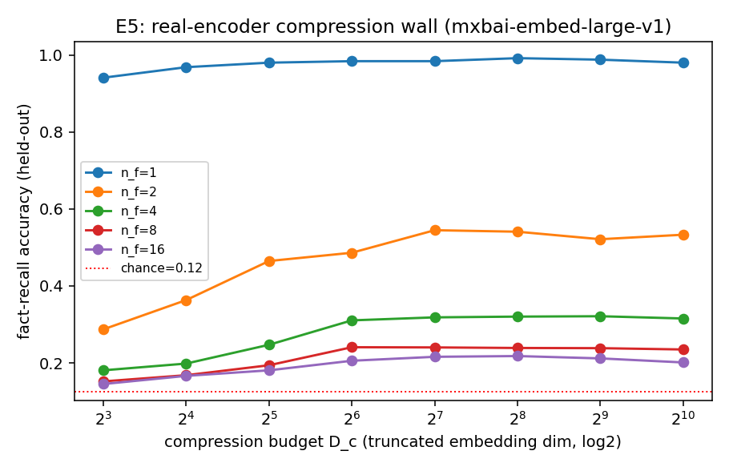

# E5 — Real-Encoder Compression Wall (mxbai-embed-large-v1)

Multi-fact passages compressed to one frozen-encoder embedding (full dim 1024), truncated to D_c; light probe recovers a queried key's value (V=8, chance=0.125); held-out passages; seeds=[0, 1].

Critical D_c* (≥ 90% of the n_f's own full-dim recall) vs content n_f:

| facts n_f | full-dim acc | critical D_c* |
|---|---|---|
| 1 | 0.980 | 8 |
| 2 | 0.533 | 64 |
| 4 | 0.315 | 64 |
| 8 | 0.235 | 64 |
| 16 | 0.201 | 64 |

If D_c* grows with n_f, a real encoder shows the same compression wall as the
free-slot model (E2): more content needs more code. With the real retrieval wall
(E4), both fixed-d bottlenecks are now validated on real models.

