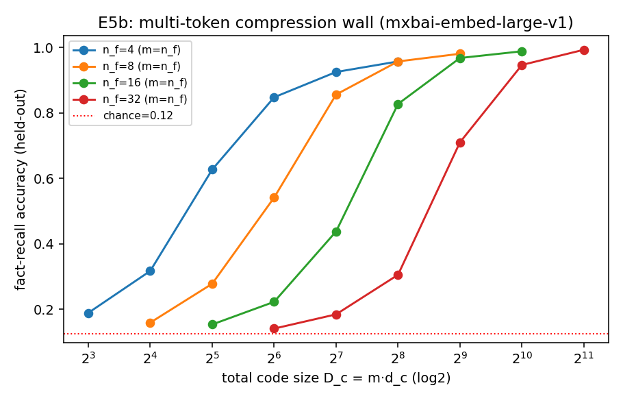
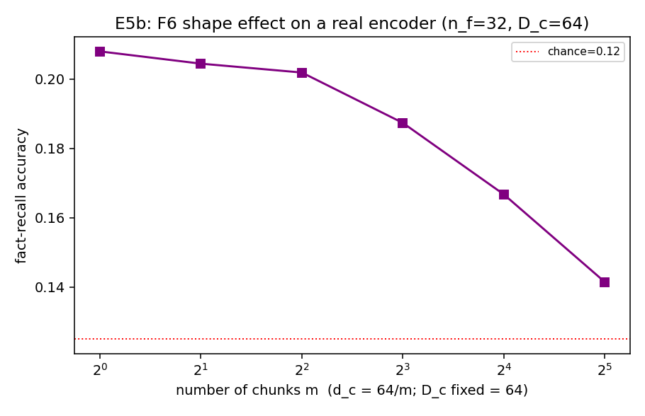

# E5b — Multi-Token Real Compression (mxbai-embed-large-v1)

Per-fact embeddings pooled into m chunks (each truncated to d_c). V=8, chance=0.125, held-out passages, seeds=[0, 1].

**Wall (m = n_f):** recall vs total code D_c, per content n_f.

| n_f | D_c at d_c=max | recall |
|---|---|---|
| 4 | 256 | 0.957 |
| 8 | 512 | 0.980 |
| 16 | 1024 | 0.988 |
| 32 | 2048 | 0.993 |

**Shape / F6 (n_f=32, fixed D_c=64):** recall vs number of chunks m.

| m | d_c | recall |
|---|---|---|
| 1 | 64 | 0.208 |
| 2 | 32 | 0.204 |
| 4 | 16 | 0.202 |
| 8 | 8 | 0.187 |
| 16 | 4 | 0.167 |
| 32 | 2 | 0.141 |

Best m = **1** (interior optimum reproduces E2's F6 on a real encoder if m=1 and large-m both underperform). Multi-token compression recovers capacity that
the single vector (E5) lost — the compression budget should be spread across several
soft tokens, not one fat one.

