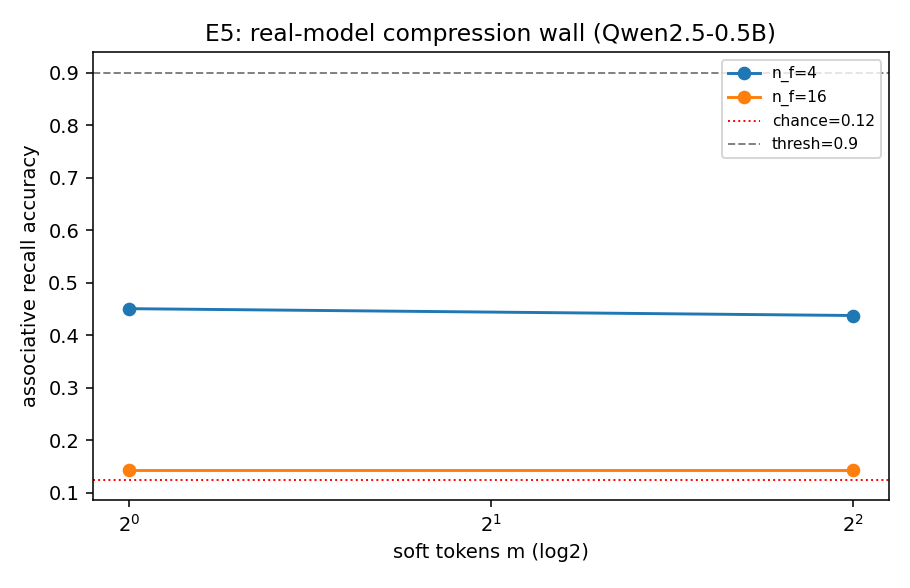

# E5 — Real-Model Compression Wall (Qwen2.5-0.5B)

Frozen LLM reads m soft tokens (trained write-projector + read-head); closed-set recall over V=8 values (chance=0.125); seeds=[0].

Critical soft-token count m* (acc ≥ 0.9) vs content complexity n_f:

| facts n_f | critical m* |
|---|---|
| 4 | > max m |
| 16 | > max m |

If m* grows with n_f, a real frozen LLM shows the same compression capacity wall as
the free-slot model (E2) — validating F9 on the compression side and completing the
real-model evidence that both bottlenecks are genuine.

