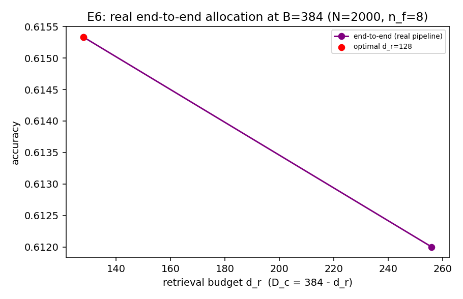

# E6 — Real End-to-End Allocation (mxbai-embed-large-v1)

One corpus: N=2000 passages (unique similar topics), n_f=8 facts each; 1500 queries; real retrieval + real compression share B = d_r + D_c.

| budget B | standalone retrieval | standalone compression | best-split e2e | optimal d_r:D_c | compounding gap |
|---|---|---|---|---|---|
| 128 | 0.626 | 0.890 | 0.234 | 64:64 | 0.392 |
| 256 | 0.692 | 0.982 | 0.555 | 128:128 | 0.137 |
| 384 | — | — | 0.615 | 128:256 | — |

Real-model instantiation of E3: on a single task with real embeddings, the best
budget split underperforms either stage given the full budget (positive gap =
compounding), and the optimal allocation is interior — the deployed big-embedder /
tiny-compressor habit is off the frontier.

