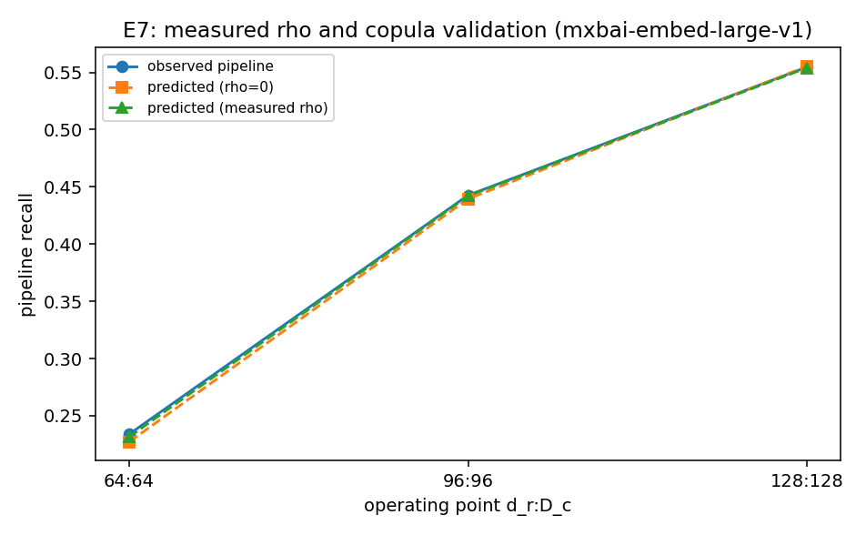

# E7 — Measured Hardness Correlation ρ (mxbai-embed-large-v1)

Real retriever + real compressor on E6's shared corpus (N=2000, n_f=8, 1500 queries). Per-query retrieval margin & compression logit margin → ρ.

| d_r:D_c | p_R | p_C | ρ_phi | ρ_margin | observed | pred(ρ=0) | pred(ρ) |
|---|---|---|---|---|---|---|---|
| 64:64 | 0.368 | 0.618 | +0.028 | +0.040 | 0.234 | 0.227 | 0.232 |
| 96:96 | 0.546 | 0.805 | +0.015 | +0.030 | 0.443 | 0.439 | 0.442 |
| 128:128 | 0.626 | 0.890 | -0.016 | +0.013 | 0.555 | 0.555 | 0.554 |

Mean ρ_phi = **+0.009** → this real pipeline sits in the **≈ multiplicative (independent)** regime.
Copula validation: mean |observed − predicted| = 0.004 (ρ=0) vs 0.001 (measured ρ); the lower one is the better model of real compounding.

This closes F10: ρ is measurable for a real retriever+compressor, it determines the
regime E3b predicts, and the copula reproduces the observed end-to-end recall.

