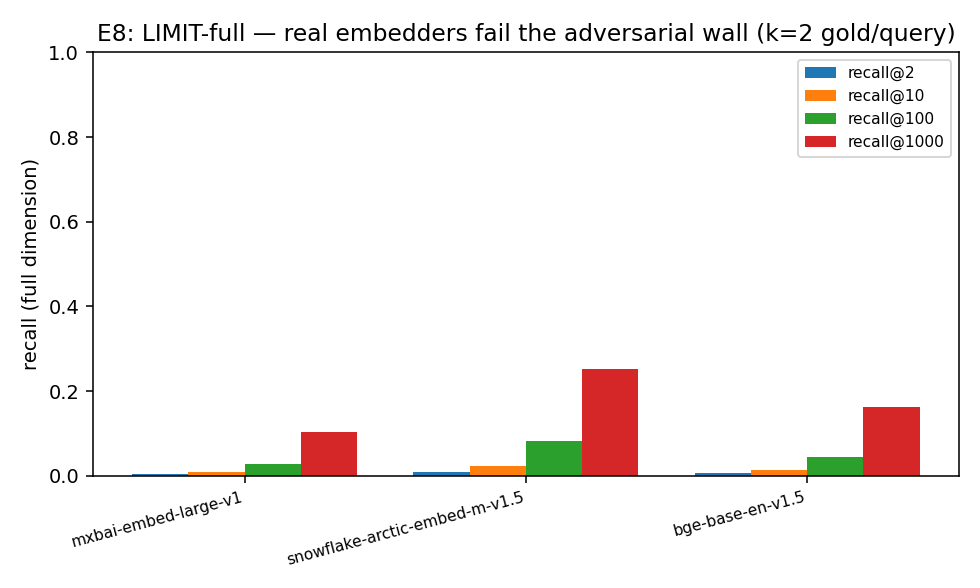

# E8 — LIMIT-full Adversarial Retrieval Wall

Weller et al.'s LIMIT realizes the all-pairs (k=2) pattern in natural language: 50000 docs, 1000 queries, each with 2 gold docs. Recall at FULL embedding dimension (no truncation) — low recall here is the real-data, real-model echo of E1's capacity wall, across embedder families (C1 generality).

| model | full dim | recall@2 | recall@10 | recall@100 | recall@1000 |
|---|---|---|---|---|---|
| `mixedbread-ai/mxbai-embed-large-v1` | — | 0.004 | 0.010 | 0.028 | 0.103 |
| `Snowflake/snowflake-arctic-embed-m-v1.5` | — | 0.009 | 0.024 | 0.082 | 0.254 |
| `BAAI/bge-base-en-v1.5` | — | 0.007 | 0.015 | 0.045 | 0.163 |

Consistent low recall across embedder families (not one model's quirk) confirms the
capacity wall is a property of the single-vector paradigm, on Weller's own data.

