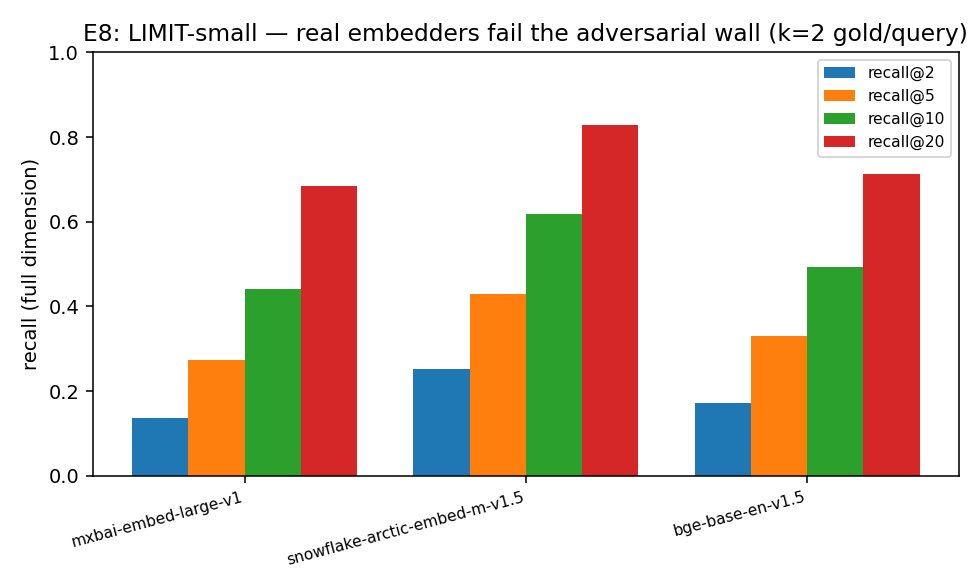

# E8 — LIMIT-small Adversarial Retrieval Wall

Weller et al.'s LIMIT realizes the all-pairs (k=2) pattern in natural language: 46 docs, 1000 queries, each with 2 gold docs. Recall at FULL embedding dimension (no truncation) — low recall here is the real-data, real-model echo of E1's capacity wall, across embedder families (C1 generality).

| model | full dim | recall@2 | recall@5 | recall@10 | recall@20 |
|---|---|---|---|---|---|
| `mixedbread-ai/mxbai-embed-large-v1` | — | 0.136 | 0.274 | 0.441 | 0.684 |
| `Snowflake/snowflake-arctic-embed-m-v1.5` | — | 0.253 | 0.429 | 0.619 | 0.828 |
| `BAAI/bge-base-en-v1.5` | — | 0.172 | 0.331 | 0.492 | 0.713 |

Matryoshka truncation (recall@10) — the wall deepens as d shrinks:

| model | d=16 | d=32 | d=64 | d=128 | d=256 |
|---|---|---|---|---|---|
| `mixedbread-ai/mxbai-embed-large-v1` | 0.265 | 0.293 | 0.307 | 0.342 | 0.379 |
| `Snowflake/snowflake-arctic-embed-m-v1.5` | 0.287 | 0.314 | 0.376 | 0.455 | 0.570 |
| `BAAI/bge-base-en-v1.5` | 0.279 | 0.304 | 0.355 | 0.391 | 0.439 |

Consistent low recall across embedder families (not one model's quirk) confirms the
capacity wall is a property of the single-vector paradigm, on Weller's own data.

