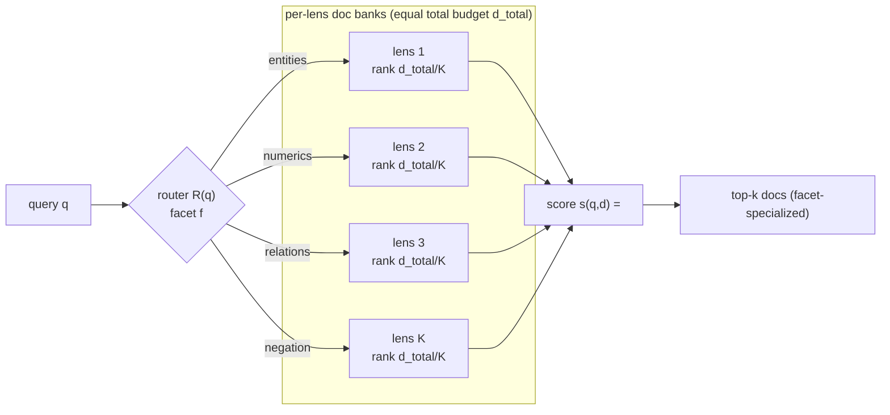
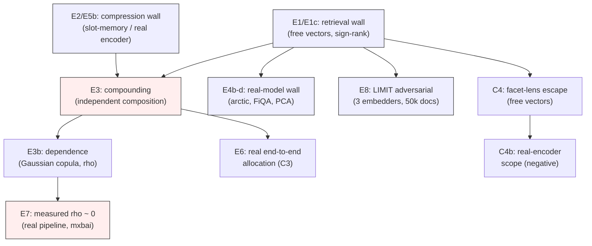

# Mermaid diagrams for manual inclusion

Two diagrams I could not render cleanly as vector art from a script are given here as
Mermaid.js source. Paste each into any Mermaid renderer (e.g. mermaid.live, or the VS Code
Mermaid extension), export to PDF/PNG, and drop into `figures/`. The paper does **not**
depend on them — Figure 1 (`figures/fig1_concept.pdf`) already carries the core schematic —
so treat these as optional supplements (e.g. for an appendix or slides).

## D1 — Facet-lens routing (the C4 method)

## D2 — Experimental map (how the blocks build on one another)

